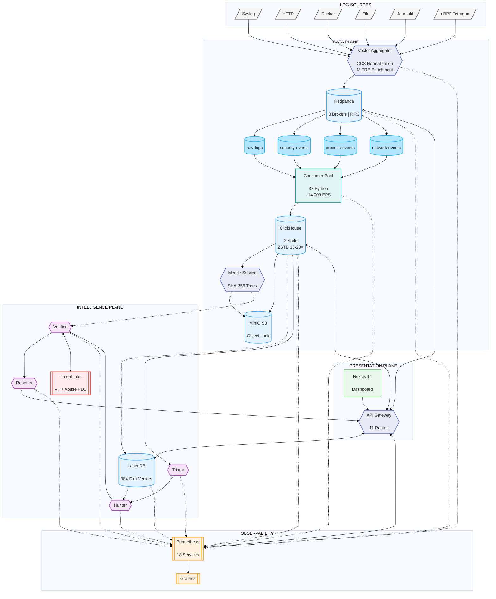

# CLIF — Pipeline & Architecture Overview

> **Smart India Hackathon 2024 — SIH1733**  
> **AI-Based Log Investigation Framework for Next-Gen Cyber Forensics**

---

## 1. End-to-End Pipeline Flow

CLIF is organized into **four architectural planes**: Data Plane, Intelligence Plane, Presentation Plane, and Observability. Events flow from diverse log sources through normalization, streaming, storage, and AI-powered investigation.



### Pipeline Stage Breakdown

| Stage | Component | What Happens | Output |
|-------|-----------|--------------|--------|
| **1. Collect** | 6 Log Sources | Syslog (RFC 5424), HTTP webhooks, Docker logs, file tails, journald, and **eBPF Tetragon** (kernel syscalls). Tetragon captures `execve`, `connect`, `open`, `write` with full process trees. **Can block threats in real-time.** | Raw events |
| **2. Normalize** | Vector Aggregator | Parses events using VRL, normalizes to **CLIF Common Schema (CCS)**, auto-tags MITRE ATT&CK techniques | Structured CCS events |
| **3. Stream** | Redpanda (3 brokers) | Kafka-compatible cluster distributes events across **4 topics** (raw-logs, security-events, process-events, network-events). RF=3 for durability | Partitioned streams |
| **4. Consume** | Consumer Pool (3× Python) | Batch inserts at **114,000 EPS** sustained, async writes to ClickHouse | Queryable storage |
| **5. Store** | ClickHouse (2-Node) | Columnar analytics with **ZSTD 15-20× compression**, 3-tier TTL (Hot→Warm→Cold) | Sub-100ms queries |
| **6. Anchor** | Merkle Service → MinIO | SHA-256 Merkle trees for tamper-proof evidence, stored with **S3 Object Lock** (WORM) | Forensic integrity |
| **7. Embed** | LanceDB | Vectorizes logs with `all-MiniLM-L6-v2` (**384-dim**), enables semantic similarity search | 494K+ embeddings |
| **8. Investigate** | AI Agents (4-stage) | **Triage → Hunter → Verifier → Reporter** pipeline with threat intel integration | Incident reports |
| **9. Present** | Next.js 14 + API Gateway | Dashboard with 14 pages, **11 API routes** connecting to all data stores | SOC interface |
| **10. Observe** | Prometheus + Grafana | Metrics collection from **18 services**, alerting, dashboards | Operational visibility |

### Key Data Flow Connections

| Connection | Type | Description |
|------------|------|-------------|
| Sources → Vector | Solid | All 6 log sources feed into Vector for normalization |
| Vector → Redpanda | Solid | Normalized events sink to Kafka-compatible streaming |
| Redpanda → Topics → Consumers | Solid | Events distributed across 4 topics, consumed in parallel |
| Consumers → ClickHouse | Solid | Batch inserts at 114,000 EPS into columnar storage |
| ClickHouse → Merkle → MinIO | Solid | Evidence anchoring: logs hashed → Merkle trees → immutable S3 |
| ClickHouse -.-> LanceDB | Dotted | Async vectorization: logs embedded for semantic search |
| ClickHouse → Triage Agent | Solid | Agent pipeline starts with ClickHouse query for new events |
| Triage → Hunter → Verifier → Reporter | Solid | Sequential agent handoff with enriched context |
| LanceDB -.-> Hunter | Dotted | Hunter queries similar historical incidents via RAG |
| Verifier <--> Threat Intel | Bidirectional | IOC validation against VirusTotal + AbuseIPDB |
| Merkle -.-> Verifier | Dotted | Verifier checks Merkle proofs for log integrity |
| Reporter → API Gateway | Solid | Final reports pushed to API for dashboard consumption |
| API <--> All Stores | Bidirectional | Dashboard queries ClickHouse, LanceDB, Redpanda, Prometheus |
| All Components -.-> Prometheus | Dotted | Metrics exported for observability |

---

## 2. Tetragon — Kernel-Level Runtime Security

### 2.1 What is Tetragon?

Tetragon is an **eBPF-based runtime security agent** developed by Isovalent (Cilium). It provides kernel-level visibility into system behavior by hooking directly into Linux syscalls — capturing what the **kernel actually executed**, not what applications chose to log.

### 2.2 Why Tetragon?

Traditional SIEMs rely on application-layer logs (syslog, auditd). These have critical blind spots:

| Limitation | Impact | Tetragon Solution |
|------------|--------|-------------------|
| Applications can omit logs | Malware hides activity | Kernel hooks capture all syscalls |
| Rootkits hide from userspace | Undetectable threats | eBPF runs before rootkit can interfere |
| No process lineage | Can't trace attack chains | Full process trees (pid→ppid→binary→args) |
| No container context | Blind to Kubernetes activity | Captures container_id, pod_name, namespace |
| Passive observation only | No prevention capability | **TracingPolicy enables real-time blocking** |

### 2.3 Tetragon's Blocking Feature (Runtime Enforcement)

**This is the critical differentiator.** Tetragon doesn't just observe — it can **actively block malicious behavior at the kernel level** before it succeeds.

```yaml
# Example TracingPolicy: Block Mimikatz (Credential Dumping)
apiVersion: cilium.io/v1alpha1
kind: TracingPolicy
metadata:
  name: block-credential-dumping
spec:
  kprobes:
    - call: "sys_ptrace"
      syscall: true
      args:
        - index: 0
          type: int
      selectors:
        - matchArgs:
            - index: 0
              operator: Equal
              values:
                - "16"  # PTRACE_ATTACH
          matchActions:
            - action: Sigkill  # ← KILL THE PROCESS
```

### 2.4 Blocking Actions Available

TracingPolicy supports three enforcement actions:

| Action | Effect | Use Case |
|--------|--------|----------|
| **Sigkill** | Immediately terminates the process with `SIGKILL` | Block known-malicious binaries (Mimikatz, Cobalt Strike) |
| **Override** | Forces syscall to return an error (e.g., `-EPERM`) | Deny unauthorized file access, block connections |
| **Signal** | Sends custom signal to the process | Pause process for analysis, custom response |

### 2.5 CLIF's Tetragon Policies

CLIF deploys TracingPolicies to detect AND block these attack patterns:

| Attack Technique | MITRE ID | Detection | Enforcement |
|------------------|----------|-----------|-------------|
| **Credential Dumping** | T1003 | `ptrace` on LSASS/shadow files | `Sigkill` |
| **Container Escape** | T1611 | Access to `/proc/*/ns/*`, mount syscalls | `Override` |
| **Fileless Malware** | T1059 | `memfd_create` + `execve` sequence | `Sigkill` |
| **Privilege Escalation** | T1548 | `setuid(0)` from non-root process | `Override` |
| **Reverse Shell** | T1059.004 | `execve` shell + `connect` to external IP | `Sigkill` |
| **Data Exfiltration** | T1041 | Large `sendto` volumes to new destinations | `Override` (connection blocked) |

### 2.6 How It Integrates with CLIF

```
┌─────────────────────────────────────────────────────────────────┐
│                      TETRAGON DEPLOYMENT                         │
├─────────────────────────────────────────────────────────────────┤
│                                                                  │
│   ┌──────────────┐     ┌────────────────────────────────────┐   │
│   │ TracingPolicy│     │          Linux Kernel               │   │
│   │ (YAML rules) │────▶│  eBPF programs hooked to syscalls   │   │
│   └──────────────┘     └──────────────────┬─────────────────┘   │
│                                            │                     │
│              ┌─────────────────────────────┼─────────────────┐   │
│              │                             │                 │   │
│              ▼                             ▼                 │   │
│   ┌──────────────────┐          ┌──────────────────┐        │   │
│   │  OBSERVE (logs)  │          │  ENFORCE (block) │        │   │
│   │  All events sent │          │  Sigkill/Override │        │   │
│   │  to Vector/CLIF  │          │  before damage    │        │   │
│   └────────┬─────────┘          └──────────────────┘        │   │
│            │                                                     │
│            ▼                                                     │
│   ┌──────────────────────────────────────────────────────────┐  │
│   │  Vector → Redpanda → ClickHouse → AI Agents → Dashboard  │  │
│   └──────────────────────────────────────────────────────────┘  │
│                                                                  │
└─────────────────────────────────────────────────────────────────┘
```

**Key Integration Points:**

1. **Tetragon is 1 of 6 log sources** — Alongside Syslog, HTTP, Docker, File, and Journald
2. **Dual-mode operation** — Each syscall event is both logged (to Vector) AND can trigger enforcement
3. **Vector receives JSON** — Tetragon outputs via gRPC/Unix socket, Vector normalizes to CCS
4. **Near-zero overhead** — eBPF is 10-100× faster than userspace agents
5. **Policy-driven** — TracingPolicies are Kubernetes CRDs, version-controlled, auditable
6. **Feeds process-events topic** — Tetragon events route to `process-events` and `network-events` topics

---

## 3. Multi-Agent AI System

CLIF's Intelligence Plane contains a **four-agent pipeline** that autonomously detects, investigates, verifies, and reports security threats. This is an implemented component powered by DSPy and LanceDB.

### 3.1 Agent Pipeline Architecture

The agents form a sequential pipeline where each agent's output feeds the next. Key data flows:

- **ClickHouse → Triage**: Agent queries new events from storage
- **LanceDB → Hunter**: RAG-based similarity search for historical context
- **Threat Intel ↔ Verifier**: Bidirectional IOC validation
- **Merkle Service → Verifier**: Log integrity verification
- **Reporter → API Gateway**: Final reports for dashboard consumption

```
┌─────────────────────────────────────────────────────────────────────────────┐
│                        INTELLIGENCE PLANE                                    │
├─────────────────────────────────────────────────────────────────────────────┤
│                                                                              │
│   ┌────────────────┐                    ┌─────────────────────┐             │
│   │  ClickHouse    │───────────────────▶│   TRIAGE AGENT      │             │
│   │  (event store) │                    │   • SQL Rule Engine  │             │
│   └────────────────┘                    │   • DSPy Classifier  │             │
│                                          │   • Output: Signal   │             │
│                                          └──────────┬──────────┘             │
│                                                     │                        │
│   ┌────────────────┐                               ▼                        │
│   │    LanceDB     │- - - - - - - - - -▶┌─────────────────────┐             │
│   │  (384-dim RAG) │   similarity       │   HUNTER AGENT      │             │
│   └────────────────┘                    │   • Entity Expansion │             │
│                                          │   • Graph Walk       │             │
│                                          │   • Output: Finding  │             │
│                                          └──────────┬──────────┘             │
│                                                     │                        │
│   ┌────────────────┐                               ▼                        │
│   │ Merkle Service │- - - - - - - - - -▶┌─────────────────────┐             │
│   │ (proof verify) │                    │   VERIFIER AGENT    │◀────────┐   │
│   └────────────────┘                    │   • IOC Validation   │         │   │
│                                          │   • FP Analysis      │         │   │
│   ┌────────────────┐                    │   • Output: Incident │◀────────┤   │
│   │  Threat Intel  │◀──────────────────▶└──────────┬──────────┘         │   │
│   │ VT + AbuseIPDB │  bidirectional                │                    │   │
│   └────────────────┘                               ▼                    │   │
│                                          ┌─────────────────────┐        │   │
│                                          │   REPORTER AGENT    │        │   │
│                                          │   • LLM Narrative    │        │   │
│                                          │   • MITRE Kill Chain │        │   │
│                                          │   • SOAR Actions     │        │   │
│                                          └──────────┬──────────┘        │   │
│                                                     │                   │   │
│                                                     ▼                   │   │
│                                          ┌─────────────────────┐        │   │
│                                          │    API GATEWAY      │        │   │
│                                          │    (11 routes)      │        │   │
│                                          └─────────────────────┘        │   │
│                                                                              │
└─────────────────────────────────────────────────────────────────────────────┘
```

### 3.2 Agent Details

#### Agent 1: Triage Agent (The Filter)

**Purpose:** High-volume noise reduction — filters millions of events down to actionable signals.

**Data Flow:** ClickHouse → Triage Agent → Signal (confidence >70%)

**Implementation:**
```python
# SQL Rule Engine Example: Detect Brute Force
SELECT source_ip, COUNT(*) as attempts
FROM security_events
WHERE category = 'authentication' 
  AND status = 'failed'
  AND timestamp > now() - INTERVAL 1 MINUTE
GROUP BY source_ip
HAVING attempts >= 5  -- T1110: Brute Force
```

```python
# DSPy Classifier (for ambiguous events)
class TriageClassifier(dspy.Module):
    def __init__(self):
        self.classify = dspy.ChainOfThought("event_log -> classification")
    
    def forward(self, event_log: str) -> str:
        # Returns: "Benign", "Suspicious", or "Critical"
        return self.classify(event_log=event_log).classification
```

**Detection Patterns (13+ MITRE Techniques):**

| Technique | MITRE ID | Detection Query |
|-----------|----------|-----------------|
| Brute Force | T1110 | 5+ failed logins in 1 minute |
| Lateral Movement | T1021 | RDP/SSH between internal hosts |
| Credential Dumping | T1003 | LSASS access patterns |
| DNS Tunneling | T1071.004 | Unusual DNS query frequency/size |
| Data Exfiltration | T1041 | Large outbound transfers to new IPs |
| Privilege Escalation | T1548 | Unauthorized sudo/admin usage |
| Defense Evasion | T1562 | Security tool process termination |

---

#### Agent 2: Hunter Agent (The Investigator)

**Purpose:** Deep investigation — assembles context and generates hypotheses.

**Data Flow:** Signal (from Triage) + LanceDB (similarity search) → EnrichedFinding

**Actions:**

1. **Entity Expansion**
   ```sql
   -- Get all activity for flagged user ±15 minutes
   SELECT * FROM security_events
   WHERE user_id = '{flagged_user}'
     AND timestamp BETWEEN '{signal_time}' - INTERVAL 15 MINUTE
                       AND '{signal_time}' + INTERVAL 15 MINUTE
   ORDER BY timestamp
   ```

2. **Similarity Search**
   ```python
   # Find similar historical incidents
   similar_events = lancedb.search(
       table="historical_incidents",
       query_vector=embed(current_event),
       limit=10,
       metric="cosine"
   )
   ```

3. **Graph Walk**
   ```
   User:alice → Process:powershell.exe → Network:192.168.1.50:445 → IP:external
        │               │                        │
        └───────────────┴────────────────────────┘
                    Attack Chain
   ```

4. **Baseline Comparison**
   ```sql
   -- Check if this is normal behavior for this user
   SELECT COUNT(*) FROM process_events
   WHERE user_id = '{user}' AND binary_path = '/usr/bin/whoami'
     AND timestamp > now() - INTERVAL 30 DAY
   -- If count = 0, this is anomalous
   ```

---

#### Agent 3: Verifier Agent (The Judge)

**Purpose:** Fact-checking — eliminates false positives and validates findings.

**Data Flow:** EnrichedFinding + Threat Intel (VT/AbuseIPDB) + Merkle Service (proof) → ConfirmedIncident

**Actions:**

1. **IOC Validation**
   ```python
   # Check IP against threat intelligence
   vt_result = virustotal.check_ip(suspicious_ip)
   abuseipdb_result = abuseipdb.check(suspicious_ip)
   
   if vt_result.malicious_votes > 5 or abuseipdb_result.score > 80:
       verdict = "CONFIRMED_MALICIOUS"
   ```

2. **Merkle Proof Verification**
   ```python
   # Ensure source logs haven't been tampered
   proof = merkle_service.get_proof(event_id)
   is_valid = merkle_service.verify_proof(
       leaf_hash=sha256(event_data),
       merkle_root=proof.root,
       proof_path=proof.path
   )
   if not is_valid:
       raise TamperDetected("Log integrity compromised!")
   ```

3. **False Positive Analysis**
   ```python
   # Compare against historical FP patterns
   fp_patterns = load_fp_patterns()  # 800+ known FP signatures
   for pattern in fp_patterns:
       if pattern.matches(enriched_finding):
           return Verdict.FALSE_POSITIVE
   return Verdict.TRUE_POSITIVE
   ```

---

#### Agent 4: Reporter Agent (The Communicator)

**Purpose:** Communication — generates human-readable reports and triggers automated responses.

**Data Flow:** ConfirmedIncident → LLM Narrative + MITRE Mapping → API Gateway (11 routes)

**Generated Report Structure:**
```markdown
# Incident Report: INV-2026-001

## Executive Summary
Confirmed lateral movement attack chain detected from workstation C102 
to domain controller DC01. Attacker used Pass-the-Hash technique.

## Kill Chain Analysis (MITRE ATT&CK)
| Phase | Technique | Evidence |
|-------|-----------|----------|
| Initial Access | T1078 Valid Accounts | Compromised creds for user:jsmith |
| Credential Access | T1003 OS Credential Dumping | Mimikatz detected on C102 |
| Lateral Movement | T1021.002 SMB/Admin Shares | C102→C4501→C892→DC01 (4 hops) |
| Defense Evasion | T1070 Indicator Removal | Event log clearing attempted |

## Timeline
- 10:15:00 — Initial login from external IP
- 10:23:15 — Mimikatz.exe execution detected
- 10:27:42 — First lateral movement hop
- 10:31:08 — DC01 access achieved

## Evidence (Merkle-Anchored)
- Event IDs: SEC-2026-44521, PROC-2026-89123, NET-2026-12847
- Merkle Root: 0x7f3a...b289
- S3 Archive: s3://clif-evidence/anchors/2026-02-11/batch-1423.tar.gz

## Recommended Actions
1. **Immediate:** Isolate hosts C102, C4501, C892
2. **Short-term:** Reset credentials for jsmith, admin accounts
3. **Long-term:** Enable MFA on all privileged accounts
```

**SOAR Integration:**
```python
# Automated Response Actions
if incident.severity >= 4:
    # Send alert
    slack.post(channel="#security-alerts", message=report.summary)
    pagerduty.create_incident(urgency="high", details=report)
    
    # Execute containment (requires human approval for destructive actions)
    if incident.type == "lateral_movement":
        soar.queue_action(
            action="isolate_host",
            target=incident.affected_hosts,
            requires_approval=True
        )
```

---

### 3.3 Why DSPy?

CLIF uses **DSPy** instead of raw prompt engineering for several reasons:

| Problem with Prompt Engineering | DSPy Solution |
|--------------------------------|---------------|
| Prompts are brittle — small changes break everything | Declarative modules with automatic optimization |
| No measurable improvement path | Built-in metrics and automated tuning |
| Hard to maintain at scale | Modular, composable, version-controlled |
| Hallucination risks | Structured output validation |

```python
# DSPy example: Structured, optimized, reliable
class IncidentClassifier(dspy.Module):
    def __init__(self):
        self.classify = dspy.ChainOfThought(
            "log_events, context -> classification, confidence, explanation"
        )
        
    def forward(self, log_events, context):
        result = self.classify(log_events=log_events, context=context)
        return {
            "classification": result.classification,
            "confidence": float(result.confidence),
            "explanation": result.explanation
        }

# Compile with optimizer for production reliability
optimizer = dspy.BootstrapFewShot(metric=classification_accuracy)
optimized_classifier = optimizer.compile(IncidentClassifier(), trainset=labeled_examples)
```

---

### 3.4 Dashboard Integration

The AI Agents page in CLIF's dashboard shows real-time agent status:

| Agent | Status | Cases Processed | Accuracy | Avg Response Time |
|-------|--------|-----------------|----------|-------------------|
| Triage Agent | Active | 142 | 94.2% | 1.2s |
| Hunter Agent | Processing | 38 | 91.5% | 12.4s |
| Verifier Agent | Idle | 85 | 97.1% | 3.8s |
| Reporter Agent | Idle | 67 | 96.8% | 8.2s |

**Pending Approval Queue** (Human-in-the-Loop):
```
[APR-001] Hunter Agent requests: Isolate host C1923
          Reason: Active DNS tunneling — 234 events, 52KB data exfiltrated
          Investigation: INV-2026-003
          [ Approve ] [ Reject ] [ Investigate ]
```

---

## 4. Technology Deep Dive

This section explains every technology used in the CLIF pipeline, why it was chosen, and how it integrates with the system.

---

### 4.1 LOG SOURCES

#### Syslog (RFC 5424/3164)

**What it is:** Industry-standard protocol for log message transport, supported by virtually every network device, server, and application.

**CLIF Configuration:**
- **TCP listener:** Port 1514 (reliable delivery, connection-oriented)
- **UDP listener:** Port 1514 (legacy/high-volume devices)
- **Max message size:** 102,400 bytes
- **Connection limit:** 10,000 concurrent

**Why Syslog:** Universal compatibility — firewalls, routers, switches, Linux servers, and enterprise applications all speak syslog natively.

---

#### HTTP JSON Endpoint

**What it is:** REST API endpoint accepting POST requests with JSON-formatted logs.

**CLIF Configuration:**
- **Endpoint:** `POST /v1/logs` on port 8687
- **Format:** JSON objects or arrays (batched)
- **Headers:** `X-CLIF-Source`, `X-CLIF-Environment` for routing

**Why HTTP:** Modern applications (microservices, serverless, cloud-native) prefer HTTP over syslog. Enables direct integration without syslog forwarders.

---

#### Docker Container Logs

**What it is:** Direct collection of stdout/stderr from all Docker containers on the host.

**CLIF Configuration:**
- **Source:** `/var/run/docker.sock` mount
- **Multiline handling:** Auto-merge for stack traces
- **Exclusions:** Self-exclusion (clif-vector container)

**Why Docker Logs:** Containers are ephemeral — attaching log files won't work. Socket-based collection captures everything, including crash logs.

---

#### File Tail

**What it is:** Traditional log file monitoring with rotation handling.

**CLIF Configuration:**
- **Paths:** `/var/log/clif/**/*.log`, `/var/log/clif/**/*.json`
- **Read strategy:** From beginning (forensic completeness)
- **Fingerprinting:** Device + inode (survives rotation)
- **Max age:** Ignore files older than 24 hours

**Why File Tail:** Legacy applications, audit logs (`/var/log/auth.log`), and third-party tools often write only to files.

---

#### Journald (systemd)

**What it is:** Linux systemd's structured logging system with rich metadata.

**CLIF Configuration:**
- **Units:** sshd, sudo, cron, auditd, systemd-logind, kernel, docker, containerd, kubelet
- **Scope:** Current boot only (reduces noise)

**Why Journald:** Captures SSH logins, sudo commands, kernel messages, and service lifecycle events with perfect timestamps and metadata.

---

#### eBPF Tetragon (Detailed in Section 2)

**What it is:** Kernel-level runtime security agent using eBPF to hook syscalls.

**Key Capabilities:**
- Process execution (`execve`) with full arguments
- Network connections (`connect`, `accept`)
- File access (`open`, `read`, `write`)
- Container context (container_id, pod_name, namespace)
- **Runtime enforcement:** Sigkill, Override, Signal actions

**Why Tetragon:** Application logs can lie or be disabled. Kernel hooks capture what *actually* executed — essential for detecting rootkits, fileless malware, and container escapes.

---

### 4.2 DATA PLANE

#### Vector Aggregator (v0.42.0)

**What it is:** High-performance observability data pipeline written in Rust. Collects, transforms, and routes logs/metrics.

**Role in CLIF:**
1. **Collect:** Receive from all 6 sources (syslog, HTTP, Docker, file, journald, Tetragon)
2. **Transform:** Normalize to CLIF Common Schema (CCS) using VRL (Vector Remap Language)
3. **Enrich:** Auto-tag MITRE ATT&CK techniques based on event patterns
4. **Route:** Sink to appropriate Redpanda topics

**CLIF Common Schema (CCS):**
```
Source Fields:     src_ip, src_port, src_host, src_user
Destination:       dst_ip, dst_port, dst_host
Event Metadata:    event_type, event_category, event_action, event_outcome
Process:           process_name, process_pid, process_command_line, process_hash
Network:           protocol, bytes_in, bytes_out, direction
File:              file_name, file_path, file_hash, file_size
User:              user_name, user_domain, user_id
MITRE:             mitre_tactic, mitre_technique, mitre_subtechnique
```

**Why Vector over Logstash/Fluentd:**
| Feature | Vector | Logstash | Fluentd |
|---------|--------|----------|---------|
| Language | Rust | JVM | Ruby/C |
| Memory usage | ~50MB | ~1GB | ~100MB |
| Throughput | 10M+ EPS | ~100K EPS | ~500K EPS |
| Config language | VRL (typed) | Ruby DSL | JSON |
| End-to-end acks | Native | Plugin | Plugin |

**Configuration Highlights:**
- Disk buffers for durability (survives Redpanda outages)
- LZ4 compression on Kafka sink
- Acknowledgements enabled (at-least-once delivery)

---

#### Redpanda (v24.2.8)

**What it is:** Kafka-compatible streaming platform written in C++. No JVM, no ZooKeeper.

**Role in CLIF:**
- **Event bus:** Decouples producers (Vector) from consumers (Python workers)
- **Buffering:** 7-day retention allows replay for debugging/reprocessing
- **Parallelism:** 12 partitions per topic enable horizontal scaling

**CLIF Configuration:**
| Setting | Value | Rationale |
|---------|-------|-----------|
| Brokers | 3 | Fault tolerance (survives 1 broker failure) |
| Replication Factor | 3 | Data durability across all brokers |
| Topics | 4 | raw-logs, security-events, process-events, network-events |
| Partitions/topic | 12 | Parallelism for consumers |
| Retention | 7 days | Replay window for investigations |
| Compression | LZ4 | Fast compression, ~50% reduction |
| Max message | 10 MB | Large log batches supported |

**Why Redpanda over Kafka:**
| Feature | Redpanda | Apache Kafka |
|---------|----------|--------------|
| Runtime | C++ native | JVM |
| Dependencies | None | ZooKeeper (or KRaft) |
| Tail latency | <1ms p99 | ~10ms p99 |
| Memory efficiency | ~10× better | JVM overhead |
| Thread-per-core | Yes | No |
| Wasm transforms | Built-in | Kafka Streams (separate) |

**Benchmark Result:** 205,000+ produce EPS on commodity hardware.

---

#### Consumer Pool (3× Python)

**What it is:** Three Python consumer processes reading from Redpanda topics and writing to ClickHouse.

**Role in CLIF:**
- **Parallel consumption:** Each consumer handles 4+ partitions
- **Batch inserts:** Accumulate 10,000 events or 5 seconds, whichever first
- **Async pipeline:** Main loop never blocks on database I/O
- **Backpressure:** Queue depth monitoring, graceful slowdown

**Architecture:**
```
Consumer 1 ─┐                    ┌─ ClickHouse
Consumer 2 ─┼─ Async Batch Queue ┼─ (batch insert)
Consumer 3 ─┘                    └─ MinIO (cold tier)
```

**Why Python with AsyncIO:**
- `aiokafka` for async Redpanda consumption
- `clickhouse-connect` with async inserts
- Simple deployment (no JVM complexity)
- Easy DSPy/LLM integration for future AI-in-pipeline

**Benchmark Result:** 114,000 sustained EPS (3 consumers combined).

---

#### ClickHouse (v24.8, 2-Node Cluster)

**What it is:** Column-oriented OLAP database designed for real-time analytics on large datasets.

**Role in CLIF:**
- **Primary storage:** All events stored in columnar format
- **Analytical queries:** Sub-100ms aggregations over billions of rows
- **Tiered storage:** Hot (SSD) → Warm (HDD) → Cold (MinIO S3)

**CLIF Tables:**
| Table | Purpose | Key Columns |
|-------|---------|-------------|
| `raw_logs` | All ingested events | timestamp, source, level, message |
| `security_events` | Classified security events | severity, category, mitre_tactic, mitre_technique |
| `process_events` | Process executions (Tetragon) | pid, ppid, binary_path, arguments, syscall |
| `network_events` | Network connections | src_ip, dst_ip, protocol, bytes, dns_query |
| `evidence_anchors` | Merkle proof records | merkle_root, leaf_hashes, s3_key, prev_root |

**Why ClickHouse over Elasticsearch:**
| Feature | ClickHouse | Elasticsearch |
|---------|------------|---------------|
| Compression | 15-20× ZSTD | 2-5× |
| Storage engine | Columnar MergeTree | Inverted index |
| Query language | SQL | DSL/Lucene |
| Aggregation speed | 10-100× faster | Index-dependent |
| Native S3 tiering | Built-in | Snapshot-based |
| JVM overhead | None | ~4-8GB heap |

**Architecture:**
- **2-node replicated shard:** `ReplicatedMergeTree` engine
- **ClickHouse Keeper:** Lightweight ZooKeeper replacement for coordination
- **Storage policy:** `clif_tiered` (SSD → HDD → S3)
- **TTL rules:** Hot 7d → Warm 30d → Cold 90d+

**Benchmark Result:** 61.4ms average query latency, 37.6 QPS sustained.

---

#### Merkle Service

**What it is:** Custom Python service that builds SHA-256 Merkle trees from log batches for tamper-proof evidence.

**Role in CLIF:**
1. Query new events from ClickHouse (batch window)
2. SHA-256 hash each event individually (leaves)
3. Build binary Merkle tree from leaves
4. Chain-link with previous batch root (`prev_merkle_root`)
5. Archive batch to MinIO with versioning
6. Write anchor record to `evidence_anchors` table

**Why Merkle Trees:**
| Property | Mechanism | Forensic Value |
|----------|-----------|----------------|
| Tamper detection | Modified event → different leaf → different root | Cannot alter logs undetected |
| Chain integrity | `prev_merkle_root` linking | Breaking one batch breaks all |
| Efficient proofs | O(log n) proof size | Verify single event without downloading entire batch |
| Court admissibility | Aligns with ISO 27037, NIST SP 800-86 | Evidence accepted in legal proceedings |

**Integration:**
- **Verifier Agent:** Checks Merkle proofs before confirming incidents
- **Dashboard:** Evidence chain viewer shows proof status

---

#### MinIO (3-Node, S3-Compatible)

**What it is:** High-performance object storage with S3 API compatibility.

**Role in CLIF:**
- **Cold storage:** Archived log batches from ClickHouse TTL
- **Evidence archive:** Merkle-anchored batches with Object Lock
- **WORM compliance:** Object Lock prevents deletion/modification

**CLIF Configuration:**
| Setting | Value | Rationale |
|---------|-------|-----------|
| Nodes | 3 | Erasure coding across nodes |
| Erasure coding | EC:2 | Survives 1 node failure |
| Object Lock | GOVERNANCE mode | Prevents deletion until TTL |
| Versioning | Enabled | Proof of existence timestamps |
| Retention | 1 year minimum | Compliance requirements |

**Why MinIO over AWS S3:**
- **On-premise:** Data sovereignty, no cloud dependency
- **Cost:** No per-request or egress fees
- **Performance:** Local network latency vs. internet

---

### 4.3 INTELLIGENCE PLANE

#### LanceDB

**What it is:** Embedded vector database optimized for AI/ML workloads. Stores high-dimensional embeddings for similarity search.

**Role in CLIF:**
- **Semantic search:** Natural language queries over log data
- **RAG retrieval:** Hunter Agent finds similar historical incidents
- **Embedding storage:** 494,000+ log embeddings indexed

**CLIF Configuration:**
| Setting | Value | Rationale |
|---------|-------|-----------|
| Embedding model | all-MiniLM-L6-v2 | Fast, local, 384 dimensions |
| Index type | IVF-PQ | Sub-100ms search at scale |
| Storage | `/var/lib/clif/lancedb` | Local SSD for speed |
| Tables | `log_embeddings`, `historical_incidents` | Separate concerns |

**How Semantic Search Works:**
1. User enters: "Show me lateral movement attempts"
2. Query embedded: `embed("lateral movement attempts")` → 384-dim vector
3. Cosine similarity: Find top-K nearest neighbors in embedding space
4. Return matches: Semantically similar events (not just keyword matches)

**Why LanceDB over Pinecone/Weaviate:**
- **Embedded:** No separate server, runs in-process
- **Cost:** Free, open-source
- **Speed:** Local queries, no network latency
- **Lance format:** Columnar storage, efficient for analytics+vectors

---

#### DSPy (LLM Framework)

**What it is:** Framework for building reliable LLM pipelines with declarative modules and automatic prompt optimization.

**Role in CLIF:**
- **Agent orchestration:** All 4 agents use DSPy modules
- **Prompt optimization:** Automatic tuning for accuracy
- **Structured outputs:** Type-safe classifications

**Why DSPy over raw prompts:**
| Problem with Prompt Engineering | DSPy Solution |
|--------------------------------|---------------|
| Prompts are brittle | Declarative modules with automatic optimization |
| No measurable improvement | Built-in metrics and automated tuning |
| Hard to maintain | Modular, composable, version-controlled |
| Hallucination risks | Structured output validation |

**Example DSPy Module:**
```python
class TriageClassifier(dspy.Module):
    def __init__(self):
        self.classify = dspy.ChainOfThought(
            "event_log, context -> classification, confidence, explanation"
        )
        
    def forward(self, event_log, context):
        result = self.classify(event_log=event_log, context=context)
        return {
            "classification": result.classification,  # Benign/Suspicious/Critical
            "confidence": float(result.confidence),
            "explanation": result.explanation
        }
```

---

#### Threat Intelligence Integration

**What it is:** External API connections to validate Indicators of Compromise (IOCs).

**Integrations:**
| Provider | API | Data |
|----------|-----|------|
| **VirusTotal** | REST API | IP/hash/URL reputation, malware detection |
| **AbuseIPDB** | REST API | IP abuse reports, confidence scores |

**Role in CLIF:**
- **Verifier Agent:** Validates suspicious IPs/hashes against threat intel
- **Enrichment:** Adds reputation scores to incidents

**Example Validation:**
```python
# Verifier Agent IOC check
vt_result = virustotal.check_ip("185.234.72.11")
if vt_result.malicious_votes > 5:
    verdict = "CONFIRMED_MALICIOUS"
    confidence = 0.95
```

---

### 4.4 PRESENTATION PLANE

#### Next.js 14 Dashboard

**What it is:** React-based full-stack framework for building the SOC analyst interface.

**Role in CLIF:**
- **14 pages:** Live feed, alerts, investigations, AI agents, attack graph, evidence chain, semantic search, threat intel, system health, etc.
- **Real-time updates:** SSE/polling for live event streams
- **React Flow:** Attack graph visualization

**Architecture:**
| Component | Technology |
|-----------|------------|
| Framework | Next.js 14 (App Router) |
| UI Library | shadcn/ui + Radix |
| Styling | Tailwind CSS |
| Charts | Recharts |
| Attack graphs | React Flow |
| State | React hooks + SWR |

**Pages:**
1. Dashboard (overview)
2. Live Feed (real-time events)
3. Alerts (workflow management)
4. Investigations (case management)
5. AI Agents (agent status/approvals)
6. Attack Graph (React Flow visualization)
7. Evidence Chain (Merkle proof viewer)
8. Semantic Search (natural language)
9. Threat Intel (MITRE heatmap)
10. System Health (metrics)
11-14. Admin, Settings, Export, Help

---

#### API Gateway (11 Routes)

**What it is:** Next.js API routes providing RESTful access to all CLIF data stores.

**Routes:**
| Route | Method | Backend | Purpose |
|-------|--------|---------|---------|
| `/api/events` | GET | ClickHouse | Paginated event list |
| `/api/events/stream` | GET (SSE) | Redpanda | Real-time event stream |
| `/api/search` | POST | LanceDB | Semantic vector search |
| `/api/alerts` | GET/PATCH | ClickHouse | Alert management |
| `/api/investigations` | GET/POST | ClickHouse | Case management |
| `/api/agents` | GET | PostgreSQL | Agent status |
| `/api/evidence` | GET | MinIO + ClickHouse | Merkle proof retrieval |
| `/api/metrics` | GET | Prometheus | System metrics |
| `/api/health` | GET | All | Health checks |
| `/api/export` | POST | ClickHouse | CSV/JSON export |
| `/api/mitre` | GET | ClickHouse | ATT&CK statistics |

**Defense Layers:**
1. Rate limiting (token bucket, per-IP)
2. TTL caching (in-memory, lazy eviction)
3. Graceful degradation (partial failure ≠ total failure)
4. Structured error logging

---

### 4.5 OBSERVABILITY

#### Prometheus

**What it is:** Time-series database and monitoring system for collecting metrics.

**Role in CLIF:**
- **Scrape targets:** 18 services
- **Metrics:** Throughput, latency, queue depth, error rates, resource usage
- **Alerting:** Rule-based alerts for anomalies

**Monitored Services:**
| Service | Metrics |
|---------|---------|
| Vector | events_in, events_out, transform_errors |
| Redpanda | produce_rate, consume_lag, partition_health |
| Consumers | batch_size, insert_latency, queue_depth |
| ClickHouse | query_latency, rows_inserted, disk_usage |
| LanceDB | search_latency, index_size |
| Merkle Service | batch_duration, proof_generation_time |
| AI Agents | inference_time, token_usage, decisions/min |
| Dashboard | request_latency, active_sessions |

---

#### Grafana

**What it is:** Visualization and alerting platform for operational dashboards.

**Role in CLIF:**
- **Dashboards:** Pre-built panels for each service
- **Alerting:** Slack/PagerDuty notifications
- **Exploration:** Ad-hoc metric queries

**Dashboard Panels:**
1. **Pipeline Overview:** EPS, data flow, health status
2. **ClickHouse:** Query latency histogram, insert rate, compression ratio
3. **Redpanda:** Consumer lag, partition balance, broker health
4. **AI Agents:** Decision rate, accuracy trends, token costs
5. **Evidence Chain:** Anchor frequency, proof verification rate

---

## 5. Technology Summary Table

| Plane | Component | Version | Language | Purpose |
|-------|-----------|---------|----------|---------|
| **SOURCES** | Syslog | RFC 5424 | N/A | Network device logs |
| | HTTP | REST | N/A | Application webhooks |
| | Docker | API v1.41 | N/A | Container stdout/stderr |
| | File | N/A | N/A | Traditional log files |
| | Journald | N/A | N/A | systemd structured logs |
| | Tetragon | v1.0+ | Go/eBPF | Kernel-level telemetry + enforcement |
| **DATA** | Vector | v0.42.0 | Rust | Log aggregation + transformation |
| | Redpanda | v24.2.8 | C++ | Kafka-compatible streaming |
| | Consumer Pool | 3× | Python | Batch insertion workers |
| | ClickHouse | v24.8 | C++ | Columnar analytics |
| | Merkle Service | Custom | Python | Evidence anchoring |
| | MinIO | RELEASE | Go | S3-compatible object storage |
| **INTEL** | LanceDB | v0.6+ | Rust | Vector database for RAG |
| | DSPy | v2.4+ | Python | LLM orchestration |
| | VirusTotal | API v3 | REST | Threat intelligence |
| | AbuseIPDB | API v2 | REST | IP reputation |
| **UI** | Next.js | v14 | TypeScript | Dashboard framework |
| | React Flow | v11 | TypeScript | Attack graph visualization |
| | shadcn/ui | Latest | TypeScript | UI components |
| **OBS** | Prometheus | v2.47+ | Go | Metrics collection |
| | Grafana | v10+ | Go | Dashboards + alerting |

---

## 6. Key Technical Decisions

Critical architecture decisions optimize for forensic requirements and performance.

### ClickHouse over Elasticsearch

Columnar storage delivers **5-10× faster analytical queries** compared to Elasticsearch's row-oriented architecture. SIMD vectorization enables parallel processing across CPU cores. ZSTD compression achieves **82% reduction** versus Elasticsearch's 60-70%. Memory consumption remains **10× lower** — 14GB for CLIF versus 150GB+ for equivalent ELK deployment.

### Redpanda over Apache Kafka

Zero-copy architecture eliminates memory overhead between network and disk. **No JVM** means no garbage collection pauses that cause latency spikes. Built-in Raft consensus removes ZooKeeper dependency, simplifying deployment. Benchmarks show **3× throughput** versus Kafka on identical hardware.

### Vector over Logstash

Rust implementation provides memory safety without garbage collection. VRL offers simpler syntax than Logstash's Ruby-based DSL. Memory consumption: **512MB for Vector** versus 4GB+ for Logstash at equivalent throughput. Performance: **10× lower latency** on field transformations.

### LanceDB over Pinecone

Self-hosted deployment eliminates API costs and external dependencies. Columnar format (Apache Arrow) provides efficient compression and serialization. **No cloud latency** — queries complete locally in sub-second. Privacy preservation — embeddings never leave on-premise infrastructure.

### MinIO over AWS S3

On-premise control supports **air-gapped deployments** for government and critical infrastructure. S3-compatible API enables seamless migration to/from AWS. **Cost predictability** — no egress fees or per-request charges. Erasure coding provides better durability than RAID with lower overhead.

### Next.js 15 over React SPA

Server-side rendering accelerates initial page load by **3-5×**. API routes eliminate separate backend service complexity. File-based routing simplifies navigation. Built-in image optimization reduces bandwidth. **SEO-ready architecture** supports documentation and public-facing pages.

### Tetragon over Auditd/Sysdig

eBPF-based architecture provides **kernel-level visibility** without kernel module risks. TracingPolicy enables **runtime enforcement** (Sigkill, Override) — not just observation. Container-aware: captures pod_name, namespace, container_id natively. **Near-zero overhead** compared to userspace agents.

### DSPy over Raw Prompts

Declarative modules enable **automatic prompt optimization** rather than manual tuning. Built-in metrics allow measurable improvement tracking. Structured outputs with type validation reduce hallucination risks. **Version-controlled pipelines** enable reproducible agent behavior.

### Merkle Trees over Append-Only Logs

Mathematical proof of tampering — modified events produce different hashes. **O(log n) verification** — prove single event integrity without downloading entire dataset. Chain-linking via `prev_merkle_root` creates sequential integrity. Court-admissible evidence aligned with **ISO 27037** and **NIST SP 800-86**.

---

## 7. Benchmark Results

| Metric | Result | Grade |
|--------|--------|-------|
| **Sustained Throughput** | 114,000 EPS (consumer pool) | A |
| **Produce EPS** | 205,000+ (Redpanda) | A |
| **Data Integrity** | 0% loss (2.5M events) | A |
| **Query Latency** | 61.4ms average | A |
| **Vector Search** | 494,000+ embeddings indexed | A |
| **Compression** | 15-20× ZSTD | A |
| **Evidence Anchoring** | SHA-256 Merkle trees | ✓ |

---

**CLIF delivers enterprise-grade SIEM capabilities at zero license cost, with unique innovations in kernel-level runtime enforcement (Tetragon blocking), cryptographic evidence integrity (Merkle trees + MinIO WORM), and autonomous AI investigation (4-agent DSPy pipeline with threat intel integration).**
