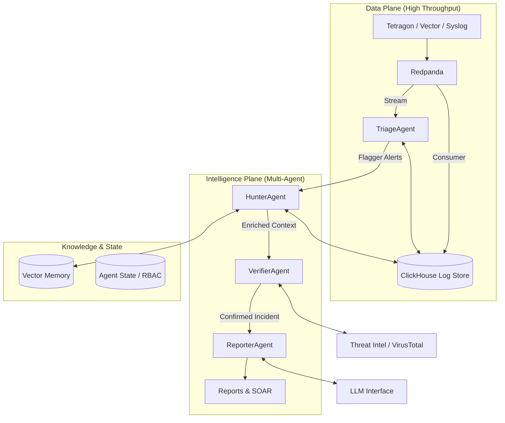

# CLIF — Production Implementation Plan: Agentic SIEM Transformation

> **Goal:** Transform CLIF from a high-performance log viewer into an autonomous, multi-agent SIEM.  
> **Architecture:** Multi-agent pipeline (Triage → Hunter → Verifier → Reporter) powered by ClickHouse + DSPy + LanceDB.  
> **Timeline:** 8-week structured roadmap.

---

## 1. Architecture: The Agentic Pipeline

We are moving beyond simple "ingest & search" to an active defense pipeline where four specialized AI agents collaborate to detect, investigate, and report threats.



---

## 2. Infrastructure Layer Upgrades

### Step 1: Tetragon & Vector eBPF Pipeline
Replace raw mock data with high-fidelity kernel observability.
*   **Deploy Tetragon:** Install as DaemonSet (k8s) or systemd service (VM) to capture process lifecycles and syscalls.
*   **Deploy Vector:** Configure as an aggregator.
    *   *Input:* Receive JSON logs from Tetragon (gRPC/Unix socket).
    *   *Transform:* Remap fields to **CLIF Common Schema (CCS)** (User, Host, Process, Network, File).
    *   *Output:* Sink to Redpanda topics `process-events` and `clif-network-events`.

### Step 2: Schema Refinement (CCS)
Normalize data upstream to ensure agents consume consistent signals.
```sql
-- New Normalized Table in ClickHouse
CREATE TABLE clif.normalized_events (
    timestamp DateTime64(9),
    event_type Enum('process_start', 'net_connect', 'file_access', 'dns_query'),
    entity_host LowCardinality(String),
    entity_user LowCardinality(String),
    related_ip Nullable(IPv6),
    related_hash Nullable(String),
    mitre_technique Array(LowCardinality(String)),
    raw_body String CODEC(ZSTD(3))
) ENGINE = ReplicatedMergeTree...
```

### Step 3: Vector Store Setup (LanceDB)
Deploy LanceDB for semantic search and Retrieval-Augmented Generation (RAG).
*   **Embeddings:** Use `all-MiniLM-L6-v2` (fast/local) or OpenAI `text-embedding-3-small` (cloud).
*   **Storage path:** `/var/lib/clif/lancedb` (or S3-backed).
*   **Collections:** 
    *   `historical_incidents`: For finding similar past attacks.
    *   `threat_intel_reports`: RAG context for the Reporter agent.

---

## 3. The Multi-Agent Implementation

### Tech Stack
*   **Orchestration:** Python (AsyncIO) + DSPy (for prompt optimization & reliability).
*   **State Management:** PostgreSQL (Agent task queues, conversation history).
*   **LLM:** Support for GPT-4o (Cloud) or Llama-3-70B (Local via Ollama/vLLM).

### Agent 1: The Triage Agent (The Filter)
*   **Role:** High-volume noise reduction.
*   **Inputs:** Real-time stream from Redpanda + Deterministic SQL Rules (ClickHouse).
*   **Logic:**
    1.  **Rule Engine:** Executes SQL templates (e.g., "5 failed logins in 1min").
    2.  **DSPy Classifier:** For logs that match broad patterns (e.g., "suspicious powershell"), classify as `Benign`, `Suspicious`, or `Critical`.
*   **Output:** Creates a `Signal` object if confidence > 70%.

### Agent 2: The Hunter Agent (The Investigator)
*   **Role:** Context assembly and hypothesis generation.
*   **Trigger:** Receives `Signal` from Triage.
*   **Actions:**
    1.  **Entity Expansion:** Queries ClickHouse for all activity by the flagged User/IP +/- 15 minutes.
    2.  **Similarity Search:** Queries LanceDB: *"Have we seen this pattern before?"*
    3.  **Graph Walk:** Maps relationships (User -> Process -> Network -> IP).
    4.  **Behavioral Analysis:** Compares against baselines (e.g., "Does this user usually run `whoami`?").

### Agent 3: The Verifier Agent (The Judge)
*   **Role:** Fact-checking and False Positive reduction.
*   **Trigger:** Receives `EnrichedFinding` from Hunter.
*   **Actions:**
    1.  **IOC Validation:** Queries VirusTotal/AbuseIPDB APIs for IPs/Hashes found.
    2.  **Evidence Anchoring:** Verifies the Merkle proof for the source logs to ensure no tampering.
    3.  **Verdict:** Assigns final `TP` (True Positive) or `FP` (False Positive) label.

### Agent 4: The Reporter Agent (The Communicator)
*   **Role:** Narrative generation and action.
*   **Trigger:** `ConfirmedIncident` from Verifier.
*   **Actions:**
    1.  **Draft Report:** Generates a Markdown summary explaining the kill chain (MITRE mapping).
    2.  **Recommended Actions:** Suggests remediation (e.g., "Isolate Host X").
    3.  **Notification:** Pushes to Slack/PagerDuty.

---

## 4. Dashboard Implementation Plan

Transition React pages from Mock to Real Agent Interfaces.

### Update `src/app/ai-agents/page.tsx`
*   **Real-time State:** Replace static JSON with a polling/SSE connection to the Agent State DB (Postgres).
*   **Visuals:**
    *   Show "Agent Thinking..." states.
    *   Live feed of "Decisions" (e.g., "Triage Agent ignored log #1234").
    *   Approval Queue: Allow human feedback to retrain DSPy modules ("This was actually benign").

### Update `src/app/investigations/page.tsx`
*   **Data Source:** Hydrate from the `ConfirmedIncident` table.
*   **Interactive Graph:** Render the Hunter's relationship graph using React Flow.
*   **Chat Interface:** Add a "Talk to Reporter" feature to ask questions about the case (RAG over case files).

### Real-Time Streaming (SSE)
*   Replace `usePolling` with a custom `useEventSource` hook connecting to a new `/api/stream/events` endpoint backed by Redis Pub/Sub (bridge from Redpanda).

---

## 5. Production Readiness Checklist

### Security & Access
*   [ ] **RBAC:** Integrate NextAuth.js (Google/GitHub/Okta).
*   [ ] **Roles:** Admin, SOC Analyst, Auditor (Read-only).
*   [ ] **Audit Logging:** Log every query and agent decision to a tamper-proof ClickHouse table.

### Automation & SOAR
*   [ ] **Webhook Actions:** Enable the Reporter agent to trigger webhooks.
*   [ ] **Playbook Engine:** Simple YAML logic for standard responses (e.g., `if ransomware -> isolate host`).

### Monitoring & Resilience
*   [ ] **Agent Metrics:** Track Token usage, latency, and Error rates in Prometheus.
*   [ ] **Queue Monitoring:** Alert if Triage -> Hunter queue backs up.

---

## 6. Phased Implementation Roadmap

### Phase 1: Foundation (Weeks 1-2)
*   **Data:** Deploy Tetragon/Vector pipeline. Normalize to CCS.
*   **DB:** Tweak ClickHouse Schema. Setup Postgres (State) and LanceDB.
*   **Auth:** Implement RBAC on Dashboard.

### Phase 2: The Agent Core (Weeks 3-5)
*   **Triage:** Build SQL Rule Engine & DSPy classifier.
*   **Hunter:** Implement Graph queries and Similarity Search.
*   **Verifier:** Connect Threat Intel APIs.
*   **Orchestration:** Wire agents together using Python AsyncIO queues.

### Phase 3: Interface & Integration (Weeks 6-7)
*   **Frontend:** Wire up AI Agents and Investigations pages to real backend.
*   **Streaming:** Implement SSE for sub-second updates.
*   **Reporter:** Implement LLM reporting and notification hooks.

### Phase 4: Battle Testing (Week 8)
*   **Red Teaming:** Re-run the LANL dataset simulation.
*   **Tuning:** Use user feedback to optimize DSPy prompts.
*   **Documentation:** Finalize operational runbooks.
